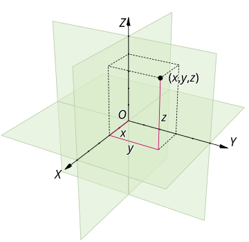

# Cartesian

The Cartesian orbital element set describes the state of an orbiting object using its position and velocity vectors in a standard coordinate system, typically the Earth-Centered Inertial (ECI) frame. Unlike classical Keplerian elements, which describe the shape and orientation of an orbit, the Cartesian set provides direct information about the object's state in 3D space at a given time.

*Image of Cartesian Orbital Elements [1]*

## Components

The Cartesian state vector consists of six elements, divided into position and velocity components:

* **Position Vector (r)** – Describes the object’s location in 3D space relative to the origin (usually the center of the Earth):
    * x: Position along the x-axis.
    * y: Position along the y-axis.
    * z: Position along the z-axis.

* **Velocity Vector (v)** – Represents the object's velocity in 3D space, indicating the direction and speed of motion:
    * ẋ: Velocity component along the x-axis.
    * ẏ: Velocity component along the y-axis.
    * ż: Velocity component along the z-axis.

## References
[1]: https://en.wikipedia.org/wiki/Cartesian_coordinate_system