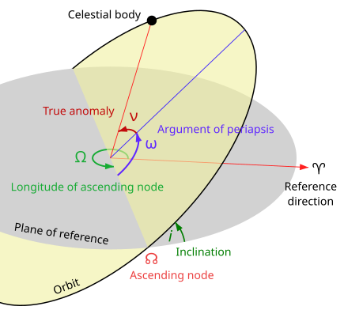

# Keplerian

The Keplerian orbital element set describes the shape, size, orientation, and position of an orbiting object using six parameters derived from classical celestial mechanics. These elements are particularly useful for characterizing two-body motion (e.g., a satellite around the Earth) and offer an intuitive understanding of the orbit’s geometry. Unlike Cartesian elements, Keplerian elements describe the orbit itself, independent of time, rather than the satellite's instantaneous position and velocity.

*Image of Keplerian Orbital Elements [1]*

## Components

The Keplerian state vector consists of six elements, divided into size & shape, orientation, and position within the orbit:

* **Orbital Shape and Size**
    * Semi-major axis (a): The average distance between the satellite and the primary body (e.g., Earth) along the longest dimension of the elliptical orbit.
    * Eccentricity (e): A measure of the orbit's deviation from a perfect circle. Values range from 0 (circular orbit) to close to 1 (highly elliptical orbit).

* **Orbital Orientation**
    * Inclination (i): The angular tilt of the orbital plane relative to the equatorial plane of the central body.
    * Longitude of the ascending node (Ω): The angle from a fixed reference direction (typically the vernal equinox) to the point where the satellite crosses the equatorial plane from south to north (ascending node).
    * Argument of periapsis (ω): The angle between the ascending node and the point of closest approach to the central body (periapsis). It defines the orientation of the orbit within the plane.

* **Position within the Orbit**
    * True anomaly (f): The angle between the satellite's current position and the periapsis, measured from the central body at a specific moment in time.

## Additional Properties

In addition to the six standard Keplerian elements stored as fields, the `Keplerian` coordinate type provides computed properties for additional anomaly types:

* **Mean Anomaly (M)**: Computed property that represents the angle the satellite would have traveled if moving in a circular orbit with the same period. Automatically calculated from the true anomaly and eccentricity.
* **Eccentric Anomaly (E)**: Computed property representing an auxiliary angle used in orbital mechanics calculations. Also automatically calculated from the true anomaly and eccentricity.

These additional properties are accessible as regular properties (e.g., `kep.M`, `kep.E`) but are computed on-demand rather than stored, ensuring consistency with the primary orbital elements while providing convenient access to commonly needed derived quantities.

## References
[1]: https://en.wikipedia.org/wiki/Orbital_elements
[2]: https://downloads.rene-schwarz.com/download/M002-Cartesian_State_Vectors_to_Keplerian_Orbit_Elements.pdf
[3]: https://downloads.rene-schwarz.com/download/M001-Keplerian_Orbit_Elements_to_Cartesian_State_Vectors.pdf
