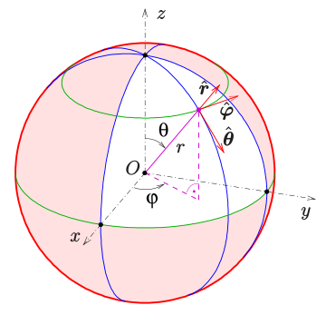

# Spherical

The Spherical Orbital Elements describe the position and velocity of an orbiting object using spherical coordinates, rather than Cartesian or Keplerian forms. These elements provide an intuitive way to represent an object's state based on angles and radial distance, making them useful in certain tracking, control, and modeling contexts. They are particularly advantageous when angular relationships are more relevant than traditional orbital parameters, such as when working with ground-based observations.

*Image of Spherical Orbital Elements [1]*

## Components

Similar to the Cartesian state vector, the spherical state vector consists of six elements, divided into position and velocity components:

* **Position Vector (r)** – Describes the object’s location in 3D space relative to the origin (usually the center of the Earth):
    * radial distance (r): 3D Euclidean distance from the origin
    * in-plane angle (θ): in-plane angle from the positive x-axis to the radial vector
    * out-of-plane angle (ϕ): out-of-plane angle from the x-y plane to the radial vector

* **Velocity Vector (v)** – Represents the object's velocity, indicating the direction and speed of motion, this is not a true 3D vector but the instaneous rate of change of each of the position components:
    * rate of change of radius (ṙ): instantaneous rate of change of the radial vector magnitude with respect to time
    * rate of change of in-plane angle (θdot): instantaneous rate of change of the in-plane angle with respect to time
    * rate of change of out-of-plane angle (ϕdot): instantaneous rate of change of the out-of-plane angle with respect to time

# Cylindrical

The Cylindrical Orbital Elements describe the state of an orbiting object using cylindrical coordinates. This set is well-suited for applications where radial distance and angular displacement are more relevant than spherical or Cartesian coordinates, such as objects in orbit around axisymmetric bodies (e.g., around a cylindrical space station or along planetary rings). These elements are useful when the symmetry of the problem aligns with a cylindrical coordinate system, making them advantageous in certain analytical models or in tracking objects relative to a central axis.

*Image of Cylindrical Orbital Elements [2]*

## Components
* **Position Vector (r)** – Describes the object’s location in 3D space relative to the origin (usually the center of the Earth):
    * in-plane radial distance (): 2D Euclidean distance from the origin in x-y plane
    * in-plane angle (θ): in-plane angle from the positive x-axis to the radial vector
    * out-of-plane distance (z): out-of-plane distance from the x-y plane

* **Velocity Vector (v)** – Represents the object's velocity, indicating the direction and speed of motion, this is not a true 3D vector but the instaneous rate of change of each of the position components:
    * rate of change of radius (ρdot): instantaneous rate of change of the x-y radial vector magnitude with respect to time
    * rate of change of in-plane angle (θdot): instantaneous rate of change of the in-plane angle with respect to time
    * rate of change of out-of-plane angle (ż): instantaneous rate of change of the out-of-plane distance

## References
[1]: https://en.wikipedia.org/wiki/Spherical_coordinate_system#Cylindrical_coordinates
[2]: https://en.wikipedia.org/wiki/Cylindrical_coordinate_system